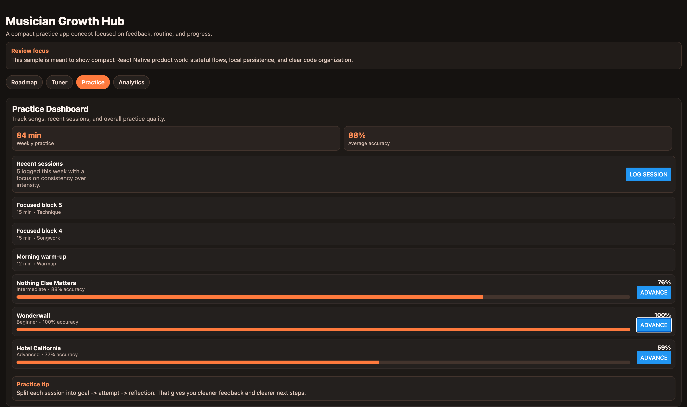
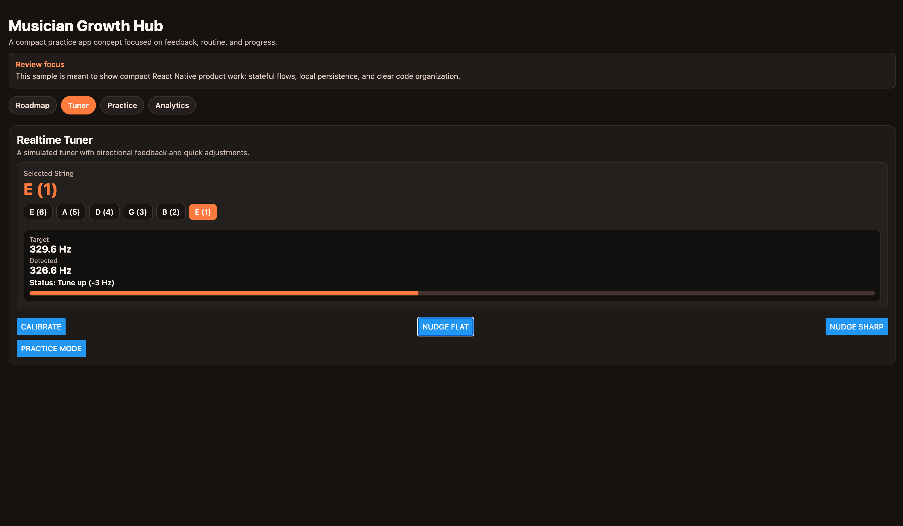
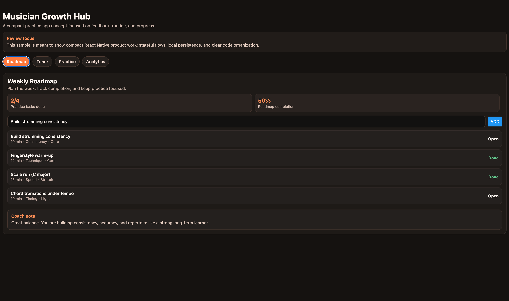

# Musician Growth Hub

A compact React Native + Expo application sample centered on practice planning, feedback, and progress tracking.

## Why this project exists

I built this as a small React Native sample focused on practice planning, feedback, and progress tracking. The goal was to keep the scope intentionally limited while still showing:

- Clear stateful flows across multiple sections
- Local persistence for learner progress
- Simple derived analytics instead of static UI
- A codebase that is easy to read and evaluate quickly

This is not meant to be a production-ready app or a full clone of any existing product. It is meant to be a focused sample that shows how I structure a compact React Native feature set and present it clearly.

## What to look at first

- [App.tsx](/Users/scarlettv/ReactNativeExpoApp/App.tsx): app flow and screen composition
- [src/utils/analytics.ts](/Users/scarlettv/ReactNativeExpoApp/src/utils/analytics.ts): derived product metrics
- [src/utils/storage.ts](/Users/scarlettv/ReactNativeExpoApp/src/utils/storage.ts): local persistence
- Commit history: small, incremental changes rather than one large dump

## What this demo shows

- A multi-surface learner flow inside a compact Expo app
- Practice roadmap management with completion tracking
- A simulated tuner with direction-aware feedback
- Song progress and accuracy tracking
- Session logging and derived analytics that update across the app
- Local persistence so learner progress survives app restarts

## Screenshots

Add these files under `screenshots/` to render the gallery in GitHub:

- `screenshots/roadmap.png`
- `screenshots/tuner.png`
- `screenshots/practice.png`





## Review notes

- Built with reusable components and typed data models
- Uses derived analytics instead of static summary values
- Persists learner state locally between app restarts
- The tuner is simulated and does not use microphone input
- Includes basic accessibility labels on major interactive elements

## Access

- Mobile: run `npm start` and open the project in Expo Go
- Web: run `npm run web`
- No backend, authentication, or external setup required

## Project structure

```text
App.tsx
src/
  components/
  data/
  types/
  utils/
```

## Run locally

```bash
npm start
```

## If I continued this

The next steps would be:

1. Adding microphone-driven pitch detection for the tuner
2. Introducing navigation and screen-level component boundaries
3. Adding tests for analytics and key interactions
